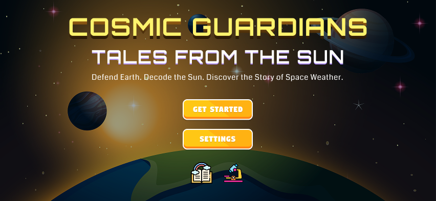

# 🌌 Cosmic Guardians – NASA Space Apps Challenge 2025

**Defend Earth. Decode the Sun. Discover the Story of Space Weather.**

---

## Project Overview

*Cosmic Guardians* is an interactive simulation and educational game that allows users to explore the complex dynamics of space weather and its impact on Earth. Players assume roles as either human Guardians or Solar Phenomena. The project integrates real-time NASA satellite data, AI-driven forecasting and immersive storytelling to provide a unique learning experience.

---
## Story Premise
In the year 2025, Earth faces its greatest challenge yet: a period of intense solar activity that threatens technology, communication, and daily life across the planet. But Earth isn't defenseless, it has the Cosmic Guardians, a diverse international team of young heroes who understand space weather and work together to protect communities worldwide.
The game begins when players discover they've been chosen as the newest Cosmic Guardian recruit. Through a mysterious "Solar Sense" ability, they can perceive space weather events before they happen, seeing solar flares as glowing dragons, coronal mass ejections as magnificent cosmic waves, and solar wind as shimmering ribbons flowing through space.
Players journey through five interconnected story chapters, each following a different Guardian protecting their community from space weather impacts. 
The twist? Players also play from the Sun's perspective in special "Solar Chronicle" missions, embodying different space weather phenomena as they journey the 93 million miles to Earth. As "Flare," a curious solar flare, or "Corona," a powerful CME, players experience the physics of space weather firsthand, learning why these phenomena occur and how they interact with Earth's magnetic field. This dual perspective creates empathy for both the communities affected and the natural cosmic forces at play, teaching that space weather isn't a villain, it's a natural phenomenon we must understand and prepare for.

## Challenge Submission
Team Name: [Team Luminex](https://www.spaceappschallenge.org/2025/find-a-team/ecosphere4/) 
Challenge: [Stellar Stories: Space Weather Through the Eyes of Earthlings](https://www.spaceappschallenge.org/2025/challenges/stellar-stories-space-weather-through-the-eyes-of-earthlings/) 
Location: Chattogram, Bangladesh

* [Project Presentation](https://youtu.be/FEjPrRmvWz8)
* [Project Wireframes](https://www.figma.com/design/wYGGDgDaMd8o4hLxLTIGdR/Untitled?node-id=0-1&t=Y5cbjqtVQzYwcUsw-1)
---

### Home Page
*The splash screen introduces the game’s theme with an immersive cosmic background and start mission button.*

### Main Menu
*Mission Control Center where players can start missions, join multiplayer alliances, check the Solar Journal, or access settings.*

### Character Selection
*Choose between the Guardian (human) perspective or Solar Phenomena (cosmic) perspective. Each perspective offers a unique gameplay experience.*

### Chapter Selection
*Select missions across the heliosphere, from the Solar Core to Terrestrial Impact Zone. Each location offers educational challenges about space weather.*

### Gameplay Screen
*Real-time missions where players respond to solar events such as flares and geomagnetic disturbances.*

### Mission Test: Cosmic Weather Simulation
*Players must decide the best immediate action during an incidence. The game provides hints about the corresponding test and infrastructure, encouraging critical thinking and decision-making.*

### Forecasting Lab 
*AI-powered lab where players analyze NASA satellite data to predict space weather impacts on Earth.*

---

## Role of AI in the Development of Cosmic Guardians

While the core project and gameplay were fully developed by our team, we leveraged AI tools strategically during the design and ideation process to enhance creativity, efficiency, and scientific accuracy:

- Concept Development:
AI helped generate storylines, mission ideas, character backstories, and dual-perspective gameplay concepts. This allowed us to explore a wide range of engaging educational scenarios, ensuring each mission conveyed both scientific accuracy and emotional impact.

- Game Mechanics & Educational Design:
AI-assisted brainstorming helped us design mini-games, forecasting challenges, and interactive puzzles that reflect real-world space weather effects, making the educational content age-appropriate and fun.

- Content Creation & Clarity:
AI tools were used to draft in-game prompts, instructional texts, and narrative explanations, which we then refined manually. This ensured that the content was clear, concise, and scientifically sound, without compromising our original vision.

- Data Visualization Planning:
AI helped us conceptualize how NASA and NOAA datasets could be represented in the game, including charts, meters, and visual alerts, guiding us toward an intuitive and interactive design.
---

## Data Sources

- [NASA Solar Dynamics Observatory (SDO)](https://sdo.gsfc.nasa.gov/)  
- [Advanced Composition Explorer (ACE)](https://science.nasa.gov/mission/ace/)  
- [Solar and Heliospheric Observatory (SOHO)](https://soho.nascom.nasa.gov/)

---
## Why Cosmic Guardians Matters

* Learn by Playing: Turns complex space weather science into fun, interactive missions.

* Real-World Impact: Shows how solar storms affect satellites, power grids, and daily life.

* Data-Driven Discovery: Uses real NASA data to teach forecasting and decision-making skills.

* Inspires Future Innovators: Sparks curiosity in STEM and space science.

* Builds Global Awareness: Highlights the importance of space weather preparedness for our connected world.
---
## Closing Vision

**Cosmic Guardians: Tales from the Sun** blends storytelling, science, and gameplay to make space weather accessible, fun, and educational. Players experience both the human and cosmic perspectives, learning that space weather is a natural phenomenon that connects everyone on Earth under the same cosmic sky.

---

  <em>"Together, we protect Earth under the same cosmic sky"</em>

