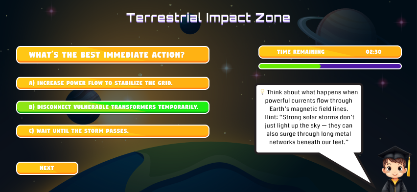

# 🌌 Cosmic Guardians – NASA Space Apps Challenge 2025

**Defend Earth. Decode the Sun. Discover the Story of Space Weather.**

---

## Project Overview

*Cosmic Guardians* is an interactive simulation and educational game that allows users to explore the complex dynamics of space weather and its impact on Earth. Players assume roles as either human Guardians or Solar Phenomena. The project integrates real-time NASA satellite data, AI-driven forecasting, and immersive storytelling to provide a unique learning experience.

---
## Challenge Submission
Team Name: [Team Luminex](https://www.spaceappschallenge.org/2025/find-a-team/ecosphere4/) 
Challenge: [Stellar Stories: Space Weather Through the Eyes of Earthlings](https://www.spaceappschallenge.org/2025/challenges/stellar-stories-space-weather-through-the-eyes-of-earthlings/) 
Location: Chattogram, Bangladesh

* [Project Presentation](https://youtu.be/FEjPrRmvWz8)
* [Project Wireframes](https://www.figma.com/design/vXe3xsi1o2AGTISsvGeKsv/NASA-HACKATHON?node-id=0-1&t=8Qqzf832YbK5EAaL-1)
---

### Home Page
*The splash screen introduces the game’s theme with an immersive cosmic background and start mission button.*

### Main Menu
*Mission Control Center where players can start missions, join multiplayer alliances, check the Solar Journal, or access settings.*

### Character Selection
*Choose between the Guardian (human) perspective or Solar Phenomena (cosmic) perspective. Each perspective offers a unique gameplay experience.*

### Chapter Selection
*Select missions across the heliosphere, from the Solar Core to Terrestrial Impact Zone. Each location offers educational challenges about space weather.*

### Gameplay Screen
*Real-time missions where players respond to solar events such as flares and geomagnetic disturbances.*

### Mission Test: Cosmic Weather Simulation
*Players must decide the best immediate action during a solar storm affecting Earth's power grid. The game provides hints about solar storm impacts on Earth's magnetic field and infrastructure, encouraging critical thinking and decision-making.*

### Forecasting Lab 
*AI-powered lab where players analyze NASA satellite data to predict space weather impacts on Earth.*

---
